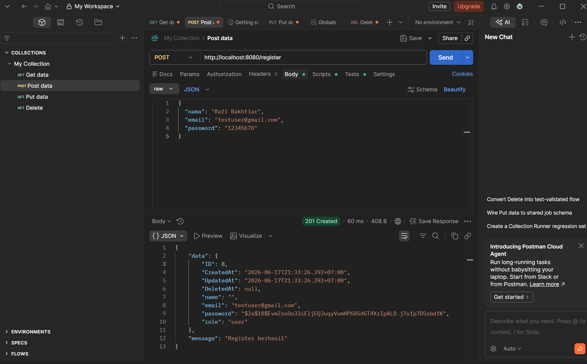
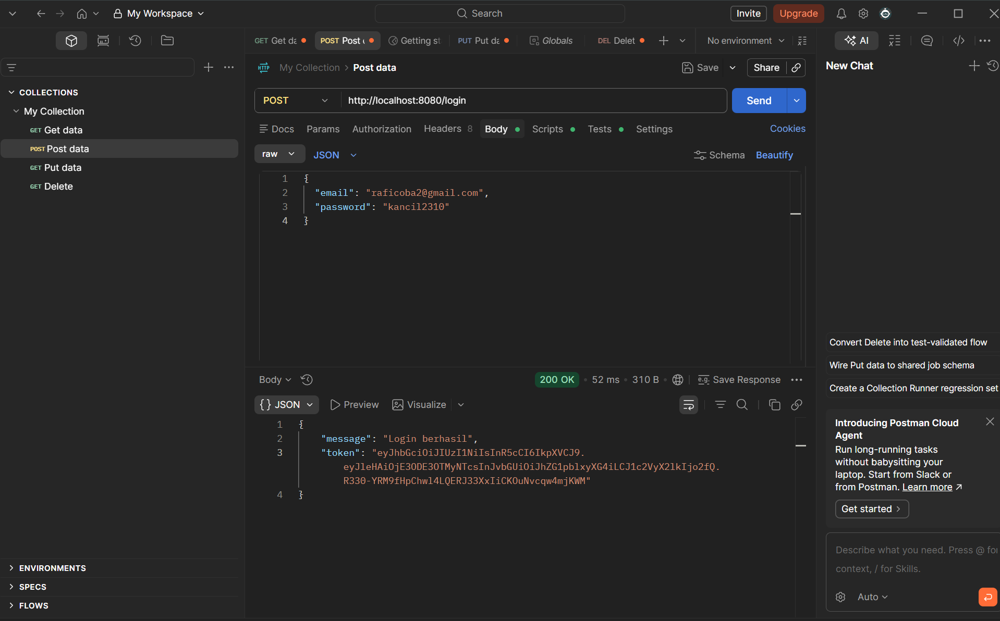
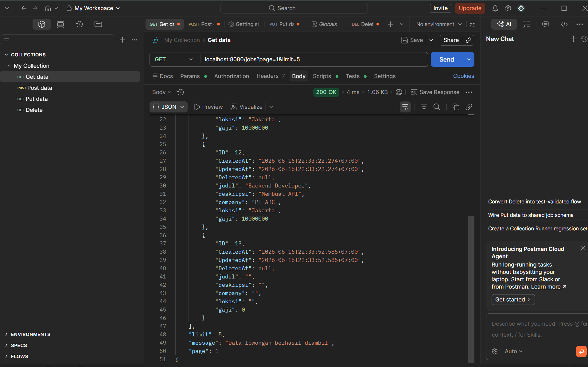
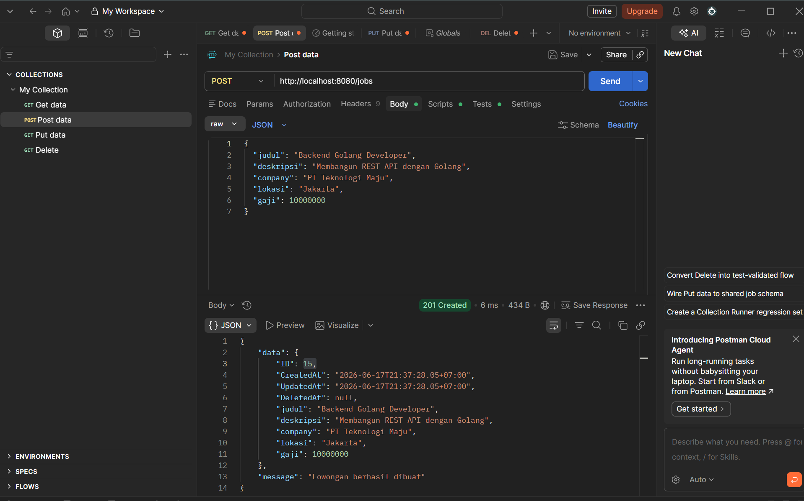
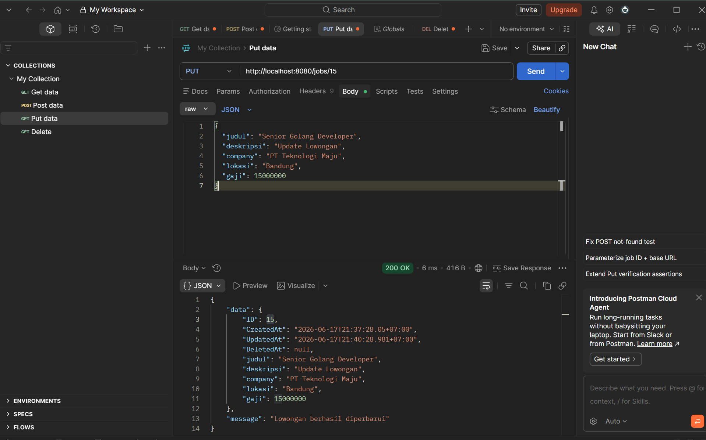
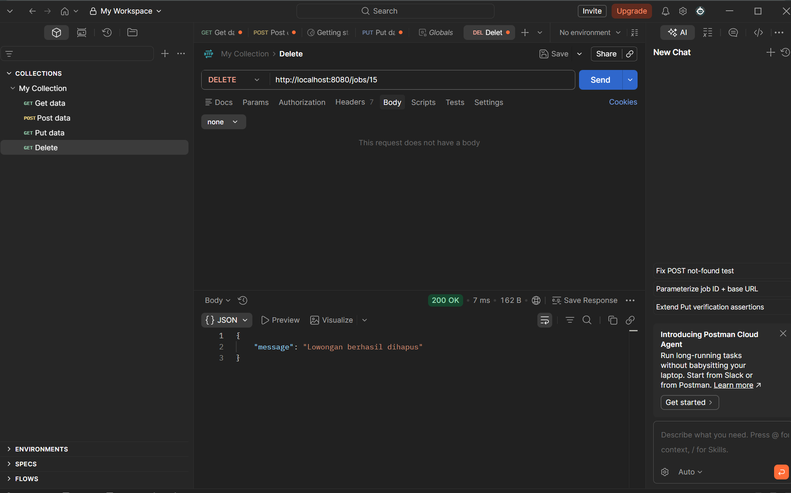

# JobConnect API

Project REST API sederhana untuk manajemen lowongan pekerjaan yang dibuat menggunakan Golang.

Project ini saya buat untuk belajar backend development menggunakan Golang, Gin Framework, GORM, JWT Authentication, dan MySQL.

## Fitur

* Register akun
* Login akun
* JWT Authentication
* Role Admin dan User
* CRUD Lowongan Kerja
* Search Lowongan
* Pagination

## Teknologi yang Digunakan

* Golang
* Gin
* GORM
* MySQL
* JWT
* Postman

## Endpoint

### Authentication

* POST /register
* POST /login

### Jobs

* GET /jobs
* GET /jobs/:id
* POST /jobs
* PUT /jobs/:id
* DELETE /jobs/:id

## Screenshot

### Register

### Login

### Get Jobs

### Create Job

### Update Job

### Delete Job

## Catatan
Pada project ini saya belajar mengenai:

* REST API
* Middleware
* JWT Authentication
* Role Based Access Control
* CRUD menggunakan GORM
* Koneksi Golang dengan MySQL
